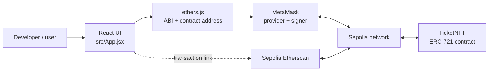

# NFT Ticket DApp

A deliberately small Web3 learning project: deploy an ERC-721 smart contract to the
Ethereum Sepolia testnet, connect a MetaMask wallet, and mint one free NFT ticket per
wallet.

The repository avoids a backend, deployment framework, and advanced contract patterns so
that the complete browser-to-blockchain flow stays visible.

> **What the NFT contains:** this starter records token IDs and ownership on-chain. It does
> not include hosted artwork or token metadata. The ticket emoji belongs to the web UI,
> not to the NFT itself.

## What you will learn

- what an ERC-721 NFT contract stores;
- how Remix compiles and deploys Solidity;
- how MetaMask exposes a wallet to a browser DApp;
- why a frontend needs both a contract address and an ABI;
- the difference between reading blockchain state and sending a transaction; and
- how a mint moves from a button click to a confirmed Sepolia transaction.

## Web3 terms in plain English

| Term | Meaning in this project |
| --- | --- |
| **Smart contract** | A Solidity program deployed at an address on Ethereum. This contract decides who may mint and records NFT ownership. |
| **Sepolia** | An Ethereum test network for application development. Its ETH has no real-world value, but transactions still use it as gas. |
| **ERC-721** | The standard interface used by non-fungible tokens. Each token ID is unique and has one owner. This project inherits OpenZeppelin's ERC-721 implementation. |
| **Wallet address** | The public account identifier selected in MetaMask, such as `0xabc...`. It is safe to share. |
| **MetaMask** | The browser wallet that holds keys, asks the user for approval, and signs transactions. The DApp never receives the private key. |
| **Contract address** | The public address of one deployed `TicketNFT` instance. Every new deployment gets a different address. It is not your wallet address or a transaction hash. |
| **ABI** | The Application Binary Interface: a description of callable contract functions and events. ethers uses it to encode `mint()` and decode `hasMinted(...)`. |
| **Provider** | The read connection to Ethereum. In this app, ethers wraps MetaMask's injected provider. Reads do not require gas. |
| **Signer** | The connected wallet account used for state-changing transactions. MetaMask asks before the signer approves `mint()`. |
| **Gas** | The network fee for computation. Minting is free in the contract, but deploying and minting still require a small amount of testnet ETH for gas. |
| **Mint** | Creating a new NFT. Here, `mint()` assigns the next token ID to `msg.sender` and marks that wallet as having minted. |

## Architecture



There are only three application layers:

1. **Contract:** `contracts/TicketNFT.sol` enforces one mint per wallet and owns the
   canonical NFT state.
2. **Connection code:** `src/contract.js` tells ethers which Sepolia address to use and
   which contract functions exist.
3. **Interface:** `src/App.jsx` asks MetaMask to connect, reads `hasMinted`, sends `mint`,
   waits for confirmation, and displays an Etherscan link.

A read such as `hasMinted(address)` travels through a **provider** and does not show a
confirmation prompt. A write such as `mint()` needs a **signer**, opens MetaMask, consumes
gas, and changes Sepolia state only after the transaction is mined.

## Before you begin

You need:

- [MetaMask](https://metamask.io/download/) installed in a supported desktop browser;
- [Remix IDE](https://remix.ethereum.org/) in the browser;
- Node.js `20.19+` or `22.12+` and npm for the frontend; and
- a small amount of Sepolia ETH. Choose a faucet from the official
  [ethereum.org Sepolia faucet list](https://ethereum.org/developers/docs/networks/#sepolia).

When using MetaMask, select or enable **Sepolia**. Its chain ID is `11155111` (hexadecimal
`0xaa36a7`). Testnet ETH is only for learning and testing.

## Part 1: Deploy the contract with Remix

### 1. Add the Solidity file

1. Open [Remix](https://remix.ethereum.org/).
2. In **File Explorer**, create a file named `TicketNFT.sol`.
3. Copy all contents of [`contracts/TicketNFT.sol`](contracts/TicketNFT.sol) into it.

The import beginning with `@openzeppelin/contracts@5.6.1` uses a pinned release of
OpenZeppelin's reusable ERC-721 implementation. Remix fetches the npm package when it
compiles. Pinning the version ensures that every learner compiles the same dependency.

### 2. Compile

1. Open the **Solidity Compiler** plugin in Remix.
2. Select compiler `0.8.30` or a newer `0.8.x` compiler compatible with
   `pragma solidity ^0.8.30`.
3. Make sure `TicketNFT.sol` is the active file.
4. Click **Compile TicketNFT.sol**.

`TicketNFT` should appear as a compiled contract. The OpenZeppelin contracts are library
dependencies; you will deploy only `TicketNFT`.

### 3. Connect Remix to Sepolia

1. Open MetaMask, choose the account that has Sepolia ETH, and select **Sepolia**.
2. In Remix, open **Deploy & Run Transactions**.
3. For **Environment**, choose **Browser Extension** / **Injected Provider - MetaMask**
   (the exact label can vary by Remix version).
4. Approve the connection in MetaMask.
5. Verify the network is Sepolia (`11155111`) and the Remix account matches MetaMask.
6. Select `TicketNFT` in the **Contract** dropdown. Leave **Value** at `0`; the constructor
   has no arguments and accepts no ETH.

Do not deploy to **Remix VM** for this walkthrough. Remix VM is a temporary in-browser
blockchain, so a contract deployed there is not available to the frontend on Sepolia.

### 4. Deploy

1. Click **Deploy**.
2. Confirm the deployment transaction in MetaMask.
3. Wait until Remix lists the instance under **Deployed Contracts**.
4. Copy the address next to that deployed instance.

It should look like a 42-character value beginning with `0x`. Copy the **contract address**,
not any of these other values:

- the wallet/account address that deployed it;
- the deployment transaction hash; or
- a token ID shown while interacting with the contract.

Keep this Remix tab open if you want to expand the deployed contract and try read functions
such as `name`, `symbol`, and `hasMinted` manually.

## Part 2: Configure and run the frontend

From the repository root:

```bash
npm install
cp .env.example .env
```

Open `.env` and replace the placeholder with the deployed address copied from Remix:

```env
VITE_CONTRACT_ADDRESS=0x1234567890abcdef1234567890abcdef12345678
```

The address is public. The `VITE_` prefix tells Vite to include this value in browser code,
which also means a Vite environment variable must never contain a private key, seed phrase,
mnemonic, API secret, or other credential.

Start the development server:

```bash
npm run dev
```

Open the local URL printed by Vite, usually `http://localhost:5173`. Restart the server after
changing `.env`, because Vite reads environment variables when it starts.

## Part 3: Connect MetaMask and mint

1. Click **Connect MetaMask**.
2. Choose an account in MetaMask and approve the connection. Connecting only shares the
   selected public address; it does not send a transaction.
3. Approve the request to switch to Sepolia if MetaMask displays one.
4. Click **Mint Ticket**.
5. Review and confirm the transaction in MetaMask. The contract charges no ticket price,
   so the only cost is Sepolia gas.
6. The page first shows the submitted transaction hash, then waits for a block confirmation.
7. After confirmation, open **View transaction** to inspect the call and emitted events on
   Sepolia Etherscan.

The button then shows **Ticket already minted**. This rule is enforced by the smart contract,
not just the React interface. Refreshing the page cannot bypass it. A person can still control
multiple wallets, so “one per wallet” is not the same as “one per human.”

## The mint flow in code

Follow these files in order when reading the project:

1. `connectWallet()` in `src/App.jsx` requests account access from MetaMask and asks it to
   use Sepolia.
2. `src/contract.js` supplies the deployed address and the small human-readable ABI.
3. `refreshMintStatus()` creates an ethers `Contract` with a provider and reads the public
   `hasMinted` mapping without a transaction.
4. `mintTicket()` gets a signer, creates the same contract connection with write access,
   calls `mint()`, and waits for the transaction receipt.
5. `mint()` in `contracts/TicketNFT.sol` checks the mapping, chooses a token ID, records the
   wallet, calls OpenZeppelin's `_safeMint`, and emits `Mint` (plus ERC-721's `Transfer`).

Ethereum transactions are atomic: if any requirement or mint step fails, every state change
from that call is reverted.

## Project structure and file guide

```text
nft-ticket-dapp/
├── contracts/
│   └── TicketNFT.sol      # ERC-721 ticket rules and on-chain mint state
├── src/
│   ├── App.jsx            # MetaMask connection, read calls, mint transaction, and UI
│   ├── contract.js        # Public contract address, minimal ABI, and Sepolia constants
│   ├── main.jsx           # React entry point that mounts App
│   └── styles.css         # Responsive styles for the single-page interface
├── .env.example           # Safe template for local contract configuration
├── .gitignore             # Excludes dependencies, builds, local env files, and OS files
├── index.html             # HTML shell containing React's root element
├── package.json           # npm scripts and direct JavaScript dependencies
├── package-lock.json      # Exact dependency versions for reproducible npm installs
└── README.md              # Learning guide, deployment steps, and architecture
```

### Generated folders

- `node_modules/` is created by `npm install`. Do not edit or commit it.
- `dist/` is created by `npm run build`. It contains the deployable static site and is not
  source code, so it is not committed.
- `.env` is your local copy of `.env.example`. It is intentionally ignored by Git.

## npm commands

| Command | Purpose |
| --- | --- |
| `npm run dev` | Start Vite's local development server with live reload. |
| `npm run build` | Create an optimized static build in `dist/`. |
| `npm run preview` | Serve the contents of `dist/` locally for a final check. |

For a clean dependency install that exactly follows `package-lock.json`, use `npm ci` instead
of `npm install`.

## Production build

```bash
npm run build
npm run preview
```

A hosting provider must receive `VITE_CONTRACT_ADDRESS` **before** running the build. Vite
replaces the variable at build time; changing it after deployment does not change an existing
bundle.

## Troubleshooting

### “Setup needed” or “Configure contract first”

Check that `.env` exists in the project root, the variable is named exactly
`VITE_CONTRACT_ADDRESS`, and its value is the deployed contract address. Then restart
`npm run dev`.

### MetaMask is not detected

Install/enable the extension, unlock it, and reload the page. Open the DApp in the same desktop
browser profile where MetaMask is installed.

### MetaMask is on the wrong network

Select Sepolia in MetaMask and try again. The frontend also calls
`wallet_switchEthereumChain` with chain ID `0xaa36a7`.

### “Insufficient funds”

The selected account needs Sepolia ETH for deployment and mint gas. Test ETH must be on the
Sepolia network, not another testnet.

### The call reverts with “One ticket per wallet”

That address has already minted from this deployed contract. Inspect
`hasMinted(yourAddress)` in Remix or use another learning account.

### A contract call fails even though the address looks valid

Confirm that the address belongs to `TicketNFT` on **Sepolia**. The same address format is used
on every EVM network, and accidentally pasting a wallet or a contract from another network
will not work.

### Remix cannot resolve the OpenZeppelin import

Wait for the dependency download to finish and compile again. Confirm that the import line was
copied exactly and that Remix has internet access.

## Intentional design choices

- **One contract and one React component:** easy to trace before learning frameworks such as
  Hardhat, Foundry, or contract hooks.
- **OpenZeppelin ERC-721:** avoids reimplementing a token standard while keeping the custom
  mint rule visible.
- **Minimal ABI:** teaches that the frontend only needs signatures it calls, not the entire
  compiler artifact.
- **No owner/admin role:** there are no privileged configuration or withdrawal functions.
- **No mint price:** users pay only testnet gas.
- **Checks before interaction:** `hasMinted` is updated before `_safeMint`; if minting fails,
  the whole transaction reverts.
- **No metadata/backend/database:** blockchain ownership is the only persisted application
  state in this starter.

## Secret safety

This project never needs a private key in source code or environment files. MetaMask signs in
its own extension and returns only public account/transaction data to the DApp.

Before committing changes:

```bash
git status --short
git diff --cached
```

Verify that `.env`, wallet export files, private keys, seed phrases, mnemonic phrases, and API
credentials are absent. `VITE_*` values are always public because they are bundled into the
frontend.

## Further reading

- [ERC-721 standard](https://eips.ethereum.org/EIPS/eip-721)
- [OpenZeppelin ERC-721 documentation](https://docs.openzeppelin.com/contracts/5.x/api/token/erc721)
- [Remix Solidity compiler](https://remix-ide.readthedocs.io/en/latest/compile.html)
- [Remix Deploy & Run](https://remix-ide.readthedocs.io/en/latest/run.html)
- [ethers v6 providers](https://docs.ethers.org/v6/api/providers/)
